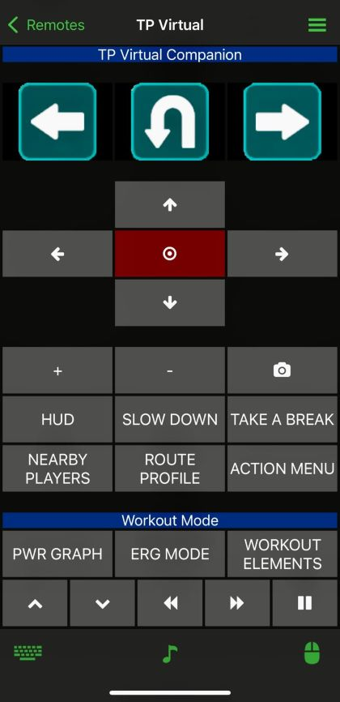

# Training Peaks Virtual Companion
A simple remote with all common in game actions for Training Peaks Virtual cycling training app.

## Features
* Turn Left
* Turn Right
* U Turn
* Up and Down
* Return/Enter
* Increase/Decrease Resistance
* Take a Screenshot
* Toggle Hud, Nearby Riders, Route Profile, Action Menu, Power/HR/Cadence Graphs, ERG Mode, and Workout Details.
* Brake/slow down
* Take a break
* Increase/Decrease workout intensity by 1%
* Skip to next/previous interval
* Pause/Resume workout

## Installation
1. Download TrainingPeaksVirtual folder from the repository.
2. Copy the folder including all its contents to:
   * Windows: 
        C:\ProgramData\Unified Remote\Remotes\Bundled\Unified\Examples
    * Mac:
        ~/Library/Application Support/Unified Remote/Remotes/Bundled/Unified/Examples
3. Open Unified server on your computer.
4. In status/dashboard screen, click on the "reload remotes" button.

#### For more information on how to create and install remotes, see [Unified Remote Documentation](https://www.unifiedremote.com/tutorials/how-to-create-a-custom-keyboard-shortcuts-remote)

## Screenshots
